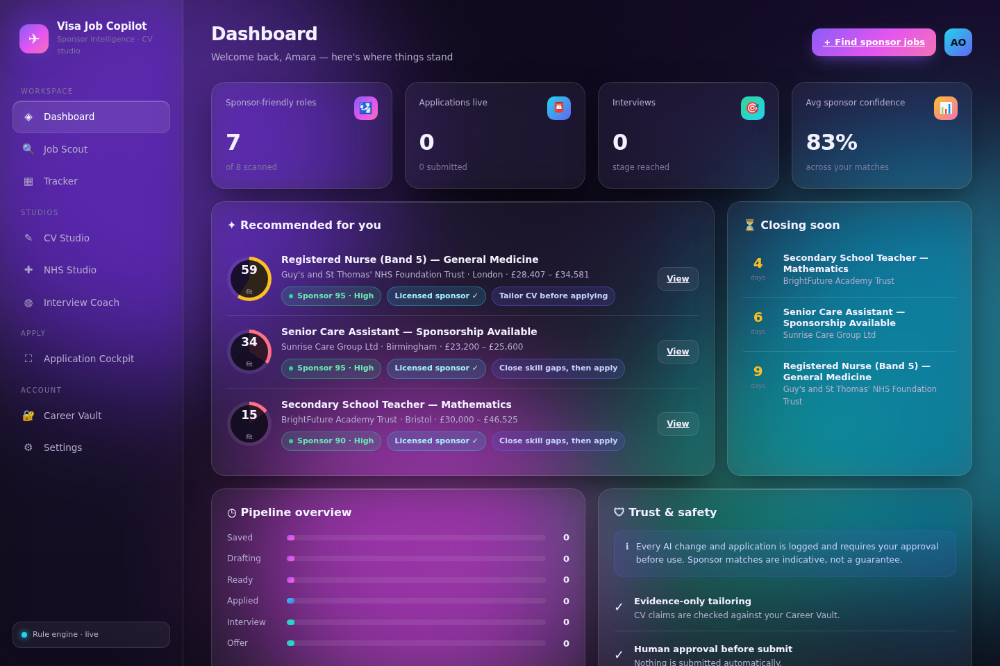

# Visa Sponsorship Job Copilot

An AI-powered **visa-sponsorship job search and application copilot** for the UK
market — job discovery with sponsor intelligence, ATS-safe CV optimisation, a
dedicated NHS supporting-statement builder, interview coaching, and an
application tracker.

Built to the *Visa Sponsorship Job Copilot — Design & Development Scope* (v1.0).
It is a **premium career agent, not a mass auto-apply bot**: every AI change is
evidence-based, human-approved before use, ATS-compatible, and lawful.

> **Positioning:** improves shortlist probability — it does **not** guarantee
> interviews, does not fabricate credentials or right-to-work answers, and does
> not bypass CAPTCHAs or automate platforms whose terms prohibit it.



---

## Highlights

- **Vibrant glassmorphism UI** — animated aurora background, frosted-glass cards,
  energetic gradient accents, score rings, and a responsive command-centre layout.
- **Full stack, zero build step** — Express REST API + a browser ES-module SPA.
  `npm install && npm start` and it runs.
- **Works with no API key** — deterministic, explainable rule engines power all
  scoring and optimisation. Add an OpenAI **or** Claude key for LLM enrichment;
  the app is provider-agnostic behind one adapter interface.

## Feature modules

| Module | What it does |
| --- | --- |
| **Dashboard** | Recommended roles, closing-soon deadlines, pipeline overview, trust & safety. |
| **Job Scout** | Sponsor-verified roles ranked by fit + visa confidence, rich filters, add-by-URL, and a transparency panel (why recommended, source, freshness, limitations). |
| **CV Studio** | The four-step loop — **Scanner → Surgeon → Stress Test → Sparring Partner** — with before/after XYZ diffs, ATS parser checks, and a keyword-balance guard. |
| **NHS Studio** | Person-specification matrix (essential scored first), evidence mapping, and a supporting-information draft in the user's voice. |
| **Interview Coach** | Role-specific technical / behavioural (STAR) / curveball questions, scored 0–10 with structured rewrites. |
| **Application Cockpit** | Assisted-apply flow with field mapping, sensitive-field pauses, and approve-before-submit. |
| **Tracker** | Drag-and-drop kanban across Saved → Drafting → Ready → Applied → Interview → Offer. |
| **Career Vault** | The single source of truth — the AI may only cite verified evidence, preventing hallucinated claims. |
| **Settings** | AI provider status, privacy controls, licensed-sponsor register search, audit log, and automation limitation notices. |

## Safety & trust (built in)

- **Evidence-only tailoring** — CV/NHS content is checked against the Career Vault; unsupported claims are flagged, never invented.
- **Keyword-balance & human-voice guards** — banned generic phrases are flagged; missing keywords are distributed, not stuffed.
- **Sponsor confidence, never a guarantee** — matches the licensed-sponsor register and job-text signals, with an explicit disclaimer.
- **Human approval before submit** and a **full audit trail** of every AI action.

---

## Quick start

```bash
cd visa-copilot
npm install
npm start          # http://localhost:3000
```

The database (a JSON store) is auto-created and seeded on first boot with a demo
candidate, a sample of the UK Register of Licensed Sponsors, and jobs across
healthcare, care, tech, engineering, education and business.

Optional — enable LLM enrichment:

```bash
cp .env.example .env
# set ANTHROPIC_API_KEY or OPENAI_API_KEY, then:
npm start
```

Reset/seed the demo data manually: `npm run seed`.

## Architecture

```
visa-copilot/
├── server/
│   ├── index.js              # Express app (static frontend + REST API)
│   ├── db.js                 # JSON persistence layer (maps to Postgres/Supabase in prod)
│   ├── seed.js               # demo sponsors, jobs, career vault
│   ├── routes/api.js         # REST endpoints
│   ├── services/             # sponsor matching, scoring, CV/NHS/interview engines
│   └── ai/
│       ├── orchestrator.js   # provider-agnostic routing + validators
│       └── adapters/         # openai.js, claude.js (same generateText interface)
└── public/                   # ES-module SPA (no build step)
    ├── index.html
    ├── css/styles.css        # glassmorphism design system
    └── js/{app,api,ui}.js + js/views/*.js
```

### AI orchestration

The deterministic engines are always the source of truth for scores and safety.
When a key is configured, the orchestrator additionally asks the model for
natural-language prose — but **all** output still passes the fact and
banned-phrase guards and requires user approval in the UI. Adapters share one
interface (`generateText`), so swapping providers is a config change.

### Selected API endpoints

```
GET  /api/status                 engine + counts
GET  /api/jobs?visaOnly&sector…  scored, filtered job grid
GET  /api/jobs/:id               role + sponsor record + transparency
POST /api/cv/scan|surgeon|stress-test
POST /api/nhs/matrix|statement
POST /api/interview/questions|score
GET  /api/applications           tracker  (POST / PATCH / DELETE)
GET  /api/sponsors/verify        employer → visa confidence
GET  /api/audit                  compliance log
```

## Production notes

This repository is a complete, runnable reference implementation. For a
production deployment the scope recommends: PostgreSQL/Supabase with row-level
security (the `db.js` interface maps directly onto it), S3-compatible object
storage for documents, a queue (BullMQ/Temporal) for ingestion and browser
sessions, real authentication + MFA, and Sentry/OpenTelemetry monitoring.
Browser automation (extension autofill, watched Playwright sessions) is scoped
as a later phase and is represented here by the Application Cockpit flow.
